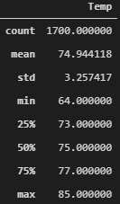
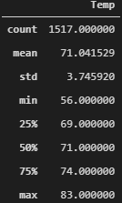

# Filtering Data using SQLite and SQLAlchemy

## Overview of the analysis
The purpose of the analysis is to query a SQLite database containing weather data from the island of Oahu and gather temperaure statistics for the month of June and December. 

## Results
SQLAlchemy module was used to estabilish a query session with the SQLite databse. The statistics show that the the June and December temperature on island of Oahu are very similar and do not have moch variation. Thus making it an ideal destination to set up a surf and ice cream business. 
1. The average temperature of June is 74.9 F. 
2. The average temperature of December is 71.0 F. 
3. 50% of the temperature values for for both June and December are between 69 F and 77 F which shows that the island has warm weather throughout the summer and winter. 

*June Temperature Statistics*

&nbsp;

*December Temperature Statistics*

## Summary
The results above provide a high level summary of the temperature statistics for the two months on the island of Oahu. The island has warm weather in both summer and winter. 
Next Steps:
1. Perform a staistical analysis on the precipation foe the months of June and December. 
2. Analyse temperature and precipitation for the whole year and find out the months that have the most ideal weather for surfing and eating ice cream .
